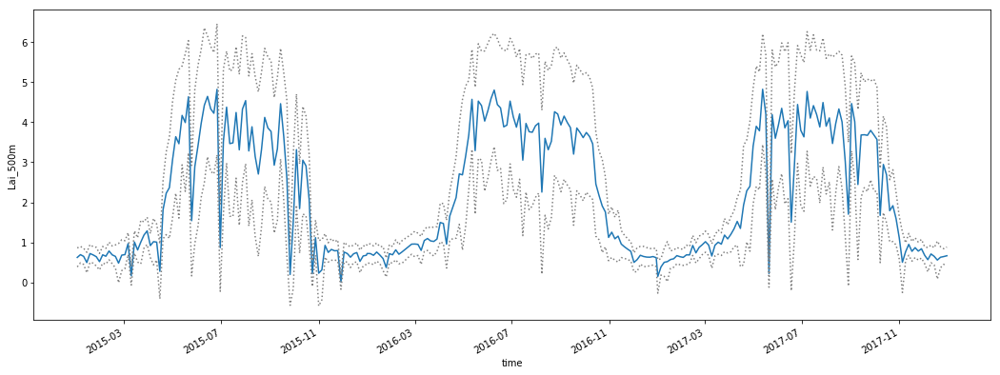
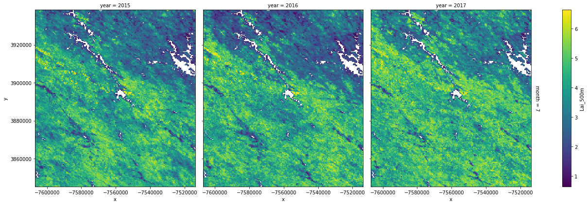

# Building Python workflows around the MODIS-VIIRS Web Service

*Author: ORNL DAAC*  
*Date: January 02, 2019*  
*Contact for ORNL DAAC: uso@daac.ornl.gov*  

### Keywords: MODIS, VIIRS, web service, Python, REST

## Overview

The jupyter notebooks in this repository will provide some examples for getting you started with building workflows around MODIS and VIIRS subsets accessed through the MODIS and VIIRS Web Service hosted at the ORNL DAAC. For a full description and usage examples of the web service, please visit the ORNL DAAC's MODIS site: https://modis.ornl.gov/data/modis_webservice.html

## Tutorials

1. Convert outputs to `xarray` data structures, generate a variety of plots, and save to netCDF [working-with-xarray.ipynb](working-with-xarray.ipynb)       

2. Convert outputs to `gdal` raster objects, plot, reproject, and save to GeoTIFF [working-with-gdal.ipynb](working-with-gdal.ipynb)       

3. Convert outputs to `rasterio` raster objects, plot, reproject, and save to GeoTIFF [working-with-rasterio.ipynb](working-with-rasterio.ipynb)       

